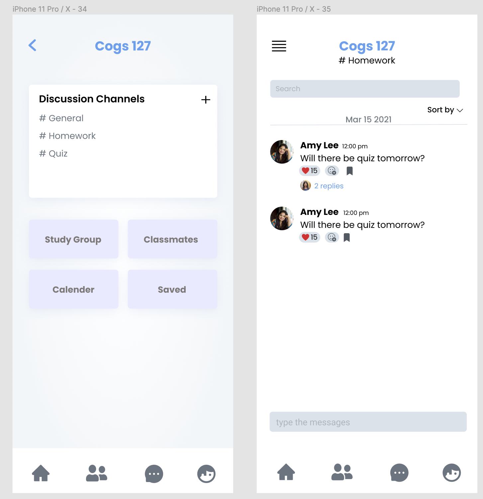
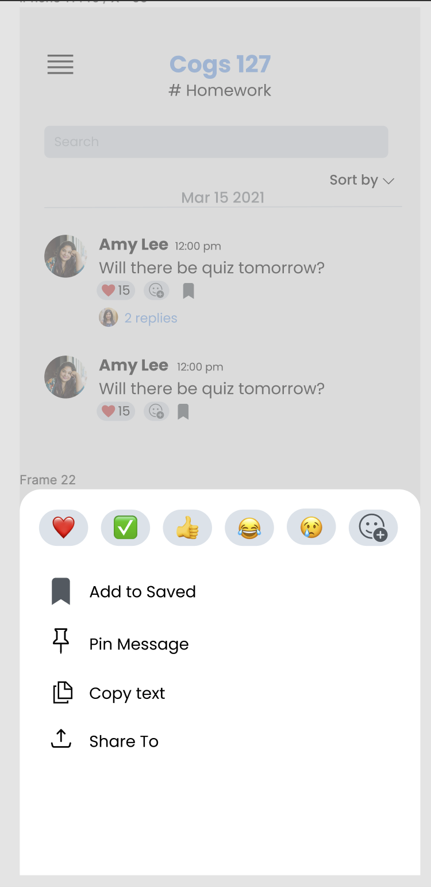

## Spring21 Week 6 Development Tasks
---
#### Week 6 Goals:
- Populate DB with python generated fake data
- Get started on Chat functionality
- Adjust home page view

#### Task Assignments and Specification
**Duolan**
- Get started on Chat from three perspective
  - Chat Struct
  - Chat backend

**Amy**
  - create fake data for course system
    - 根据上次设计的db scheme做一些data
    - 可以用Python Script完成
  - Implement course search functionality (Optional)
    - 在已有的course search界面可以直接search db里的课程
    - 最好有实时变化的auto completion
    - （可以直接从db里把所有课程拉过来，然后本地做search）
  - Self-Study
    - Firebase

**Noodles**
- 做一下下面两个界面的ui
  - Note: 
  1. 左边这个图是从home page课程的card里跳转过来的，像一个navlink一样。点击Discussion Channels里的channel会跳转到右边这个图
  2. 可以先不要做reply那一栏，因为我感觉如果是chat的话，这个reply的layout方式会有点奇怪

 
- 如果有时间的话研究一下用emoji评论的这个功能（Optional）
 

 
- Self-Study
  - SwiftUI GeometryReader
  - Firebase + SwiftUI

**Tony & Peter**
- Setup environment
- Self-Study
  - SwiftUI
  - Firebase (Optional)

#### Notes
加油！
